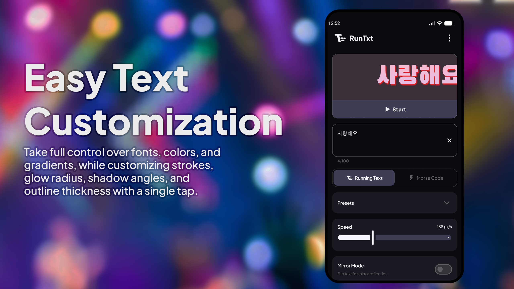
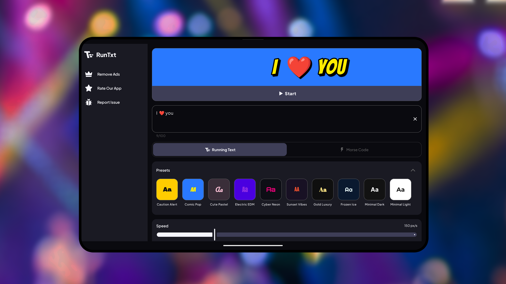
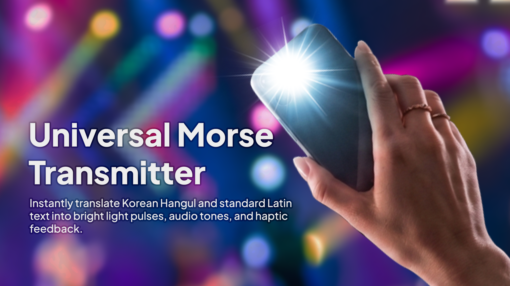
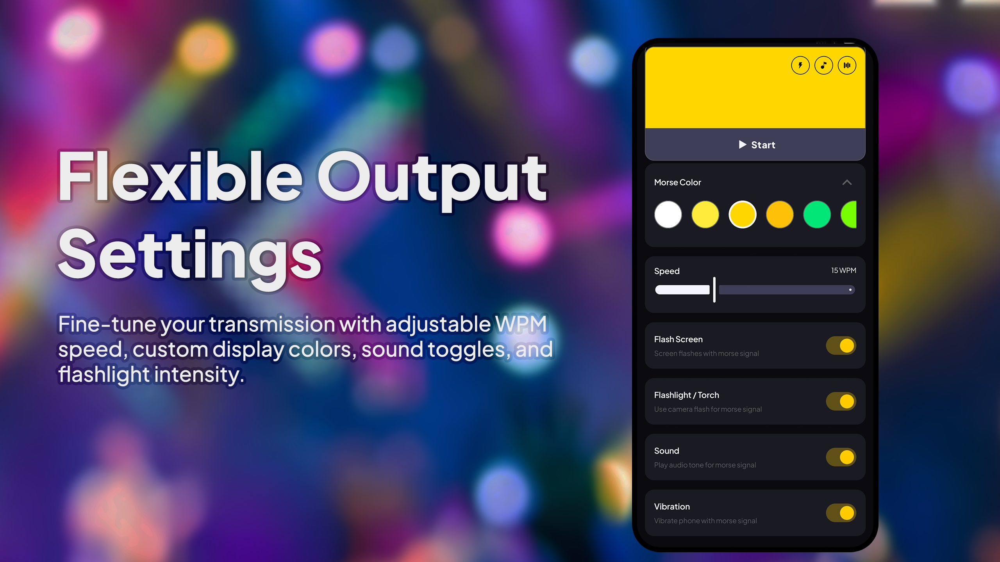

# RunTxt

RunTxt is a high-performance Android application engineered for dynamic visual communication. The platform integrates a highly customizable LED scrolling engine with a universal Morse code signaling system, supporting both standard Latin and Korean Hangul (SKATS) protocols.

---

## Core Functionality

### Advanced Text Customization
The application provides granular control over visual parameters, enabling precise rendering of textual messages. Features include full support for custom typefaces, solid color palettes, and linear gradient configurations.
- **Visual Rendering:** Integrated controls for stroke thickness, glow radius, shadow projection angles, and outline density.
- **Design Presets:** Access to pre-configured aesthetic templates including Cyber Neon, Comic Pop, Minimal Dark, and others.

  
  

### High-Performance Scrolling Engine
Optimized animation routines ensure fluid text transitions and low-latency rendering, even with extensive character strings.
- **Mirror Projection:** Horizontal orientation inversion for reflective surface applications, such as automotive dashboard displays.
- **Velocity Control:** Precise adjustment of scroll speed to meet specific environmental requirements.

  

### Universal Morse Code Transmitter
A comprehensive Morse signaling utility supporting standard Latin and Korean Hangul (SKATS) character sets.
- **Multi-Modal Output:** Signal transmission via hardware flashlight, high-intensity screen strobes, synchronized audio frequencies, or haptic vibration patterns.
- **WPM Calibration:** Quantitative control of transmission speed measured in Words Per Minute (WPM).

  
  

---

## Scope and Technical Constraints

### Platform Compatibility
The application is developed exclusively for the Android operating system. Performance and UI consistency are guaranteed for devices running API level 28 and above.

### Linguistic Limitations
The Morse code engine is specifically architected for standard Latin alphanumeric characters and Korean Hangul (utilizing the SKATS protocol). Encoding for other complex character sets or specialized symbols is currently outside the application's scope.

### Hardware Dependencies
- **Optical Signaling:** Flashlight transmission requires functional camera hardware and appropriate runtime permissions. Transmission reliability is subject to hardware-specific LED latency.
- **Haptic Output:** The precision of vibration patterns is dependent on the device's linear resonant actuator (LRA) or eccentric rotating mass (ERM) motor capabilities.
- **Display Strobe:** High-intensity screen flashing is subject to system-level brightness limits and hardware refresh rate constraints.

### Rendering Engine Constraints
The high-fidelity visual engine utilizes complex Canvas-based drawing routines to support advanced text effects.
- **Graphical Overhead:** The simultaneous application of multi-pass stroke rendering (outlines), soft-shadow projection, and linear gradients increases GPU memory consumption and draw call complexity.
- **Performance Scaling:** Rendering performance is subject to hardware acceleration capabilities and thermal throttling. Frame rate stability may vary based on string length and the density of active visual parameters.
- **Resource Intensity:** High-resolution typeface rendering combined with real-time gradient calculations requires significant computational resources, potentially increasing power consumption during prolonged display sessions.

### Signal Accuracy and Validation
The transmission precision of Morse code signals is subject to hardware-level execution and system scheduling.
- **Decoding Reliability:** While the internal engine follows standard Morse timing protocols, external factors such as LED rise/fall time and audio latency may impact machine-readability. 
- **Validation:** Quantitative verification using external Morse code decoders or reader hardware is required to guarantee signal fidelity, particularly at elevated WPM (Words Per Minute) settings.

### Power Management
Extended operation in LED scroller or Morse transmitter modes may be impacted by OS-level battery optimization policies. Active foreground execution is required for continuous signal transmission.

